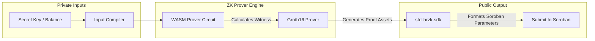

# StellarZK SDK: Client-Side Prover & Proof Generator

[](https://www.drips.network/wave)
[](https://www.typescriptlang.org/)
[](https://github.com/iden3/snarkjs)
[](https://opensource.org/licenses/Apache-2.0)

**A high-performance TypeScript client SDK that compiles circuit inputs, generates Groth16 proofs client-side, and prepares parameters for Soroban on-chain verification.**

---

# 🔐 Overview

`stellarzk-sdk` enables secure, private transfers on the client-side. To ensure transaction details (such as transfer amounts and stealth addresses) are never exposed to public RPC servers, zero-knowledge proofs must be synthesized locally in the user's browser or device. This SDK manages the complex math of proof generation, compiles circuit constraints, and formats Groth16 cryptographic structures.

### Key Capabilities:
*   **WASM Proof Synthesis:** High-performance, client-side proof generation using compiled Circom circuits.
*   **Nullifier Generation:** Secure hashing algorithms to construct commitments and nullifiers.
*   **Soroban Serialization:** Automatically parses and packages proof coordinates (`A`, `B`, `C`) into type-safe XDR parameters for Soroban contract invocation.

---

# 🏗️ Client-Side Proving Pipeline



---

# 💻 Quick Start & Usage

### 1. Installation
Install the SDK and `@stellar/stellar-sdk` dependencies:
```bash
npm install @stellarzk/sdk @stellar/stellar-sdk
```

### 2. Generating a Private Transfer Proof
```typescript
import { ZKProver, ShieldedPortalClient } from '@stellarzk/sdk';
import { Keypair } from '@stellar/stellar-sdk';

const prover = new ZKProver({
  wasmPath: './circuits/private_transfer.wasm',
  zkeyPath: './circuits/private_transfer_final.zkey',
});

async function sendShieldedPayment() {
  const secretKey = 'S...';
  const recipientStealthAddress = 'zk19v82x...';
  const amount = 100n; // Shielded XLM
  
  console.log('Generating Zero-Knowledge Proof locally...');
  const { proof, publicSignals } = await prover.generateProof({
    secret: secretKey,
    recipient: recipientStealthAddress,
    value: amount,
  });
  
  // Format the parameters for the Shielded Portal
  const client = new ShieldedPortalClient({ contractId: 'CDA...' });
  const txHash = await client.submitShieldedTransfer({
    proof,
    publicInputs: publicSignals,
  });
  
  console.log(`Private transfer submitted! Tx Hash: ${txHash}`);
}
```

---

# 📂 Repository Structure

```text
stellarzk-sdk/
├── src/
│   ├── prover/           # WASM circuit and SnarkJS integrations
│   ├── portal/           # ShieldedPortalClient parameter wrappers
│   ├── utils/            # Hashing and field mathematics
│   └── index.ts          # Module exports entry point
├── tsconfig.json         # TypeScript compiler configurations
├── package.json          # Dependency definitions
└── README.md             # You are here
```

---

# 🛠️ Development & Contributing

### Local Setup
1. **Clone the Repo:** `git clone https://github.com/stellarzk-phantom/stellarzk-sdk.git`
2. **Install Dependencies:** `npm install`
3. **Build Module:** `npm run build`
4. **Run Tests:** `npm test`

---

# 📄 License

This project is licensed under the **Apache License 2.0**.
