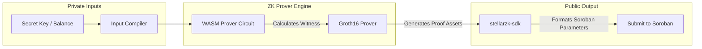

# StellarZK SDK: Client-Side Prover & Proof Generator

[](https://www.drips.network/wave)
[](https://www.typescriptlang.org/)
[](https://github.com/iden3/snarkjs)
[](https://opensource.org/licenses/Apache-2.0)

**A high-performance TypeScript client SDK that compiles circuit inputs, generates Groth16 proofs client-side, and prepares parameters for Soroban on-chain verification.**

---

# 🔐 Overview

`stellarzk-sdk` enables secure, private transfers on the client-side. To ensure transaction details (such as transfer amounts and stealth addresses) are never exposed to public RPC servers, zero-knowledge proofs must be synthesized locally in the user's browser or device. This SDK manages the complex math of proof generation, compiles circuit constraints, and formats Groth16 cryptographic structures.

### Key Capabilities:
*   **WASM Proof Synthesis:** High-performance, client-side proof generation using compiled Circom circuits.
*   **Nullifier Generation:** Secure hashing algorithms to construct commitments and nullifiers.
*   **Soroban Serialization:** Automatically parses and packages proof coordinates (`A`, `B`, `C`) into type-safe XDR parameters for Soroban contract invocation.

---

# 🏗️ Client-Side Proving Pipeline



---

# 💻 API Reference & Local Proving Playbook

### 1. Initializing the ZKProver
To execute client-side proving inside a browser or node process, instantiate the `ZKProver` pointing to the pre-compiled Circom WASM and ZKey artifacts:

```typescript
import { ZKProver } from 'stellarzk-sdk';

const prover = new ZKProver({
  wasmPath: 'https://cdn.stellarzk.org/circuits/private_transfer.wasm',
  zkeyPath: 'https://cdn.stellarzk.org/circuits/private_transfer_final.zkey',
});
```

### 2. Formulating Inputs & Synthesizing the Proof
Compile the private witnesses—the sender's keypair, the target stealth recipient, and the transfer value—and generate the Groth16 coordinates locally:

```typescript
const secretKey = 'S...';
const recipientStealthAddress = 'zk19v82x...';
const amount = 100n; // 100 Shielded Tokens

console.log('Calculating Poseidon Commitments & Local Groth16 witness...');

const { proof, publicSignals } = await prover.generateProof({
  secret: secretKey,
  recipient: recipientStealthAddress,
  value: amount,
});

console.log('Proof successfully generated locally! Coordinates:', proof.pi_a);
```

### 3. Formatting Parameters for Soroban Contracts
The SDK automatically formats the large field elements (coordinates on curves) into byte arrays compatible with Soroban XDR types:

```typescript
import { ShieldedPortalClient } from 'stellarzk-sdk';

const client = new ShieldedPortalClient({
  contractId: 'CDA...',
  rpcUrl: 'https://soroban-testnet.stellar.org',
});

// Converts mathematical arrays to Soroban Vec<Val> and BytesN
const txParams = prover.formatSorobanParameters(proof, publicSignals);

const txHash = await client.submitShieldedTransfer({
  proofA: txParams.proofA, // BytesN<64>
  proofB: txParams.proofB, // BytesN<128>
  proofC: txParams.proofC, // BytesN<64>
  publicInputs: txParams.publicInputs, // Vec<Val>
});

console.log(`Shielded transaction submitted successfully! Tx: ${txHash}`);
```

---

# 📂 Repository Structure

```text
stellarzk-sdk/
├── src/
│   ├── prover/           # WASM circuit and SnarkJS integrations
│   │   ├── ZKProver.ts   # Core client-side Groth16 provers
│   │   └── types.rs      # Proof coordinate interfaces
│   ├── portal/           # ShieldedPortalClient parameter wrappers
│   ├── utils/            # Hashing and field mathematics
│   └── index.ts          # Module exports entry point
├── tsconfig.json         # TypeScript compiler configurations
├── package.json          # Dependency definitions
└── README.md             # You are here
```

---

# 🛠️ Development & Contributing

### Local Setup
1. **Clone the Repo:** `git clone https://github.com/stellarzk-phantom/stellarzk-sdk.git`
2. **Install Dependencies:** `npm install`
3. **Build Module:** `npm run build`
4. **Run Tests:** `npm test`

---

# 📄 License

This project is licensed under the **Apache License 2.0**.
